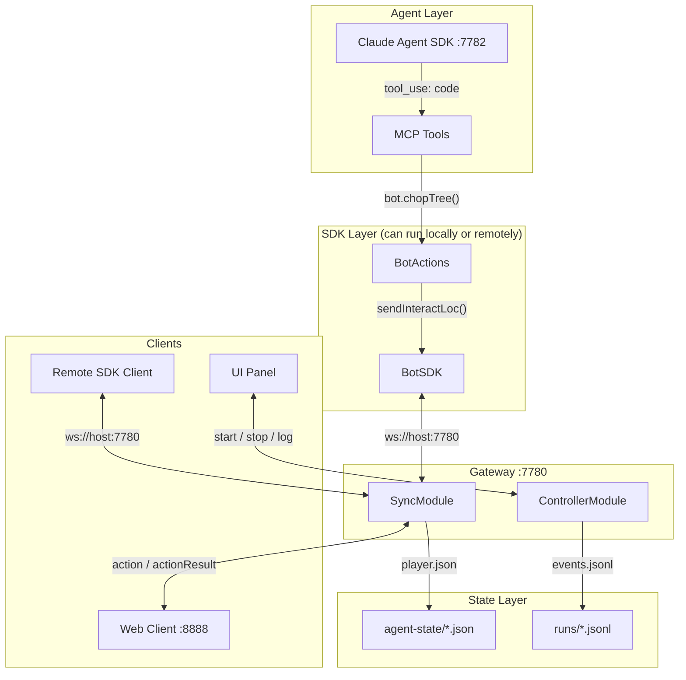
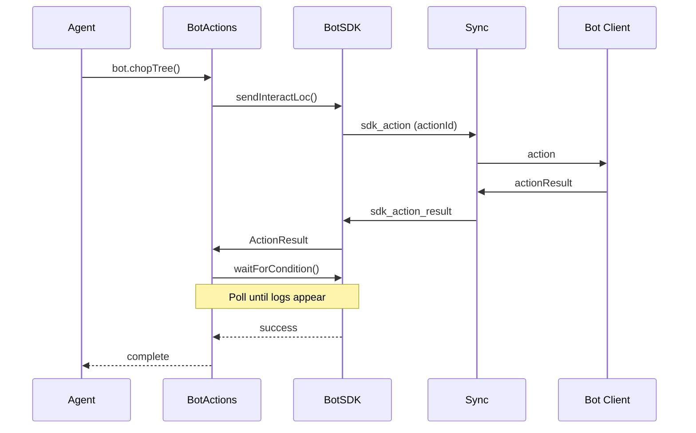
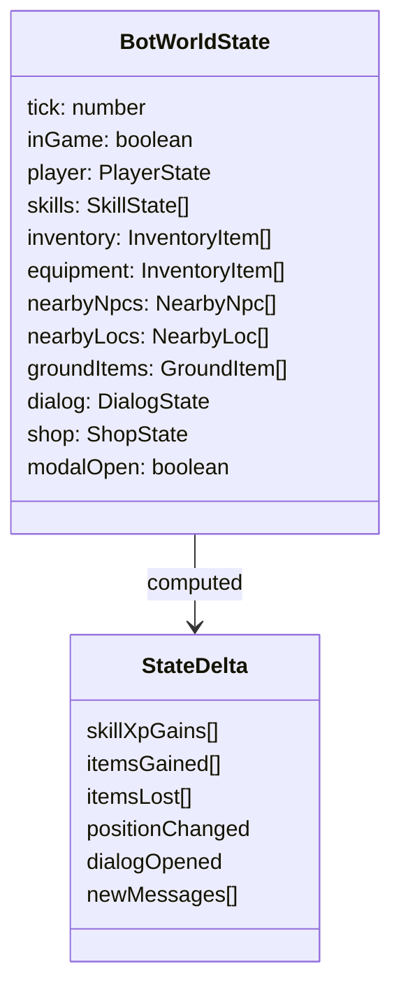
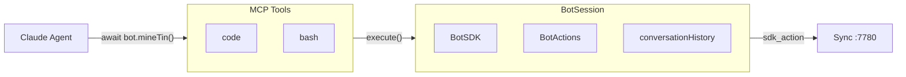
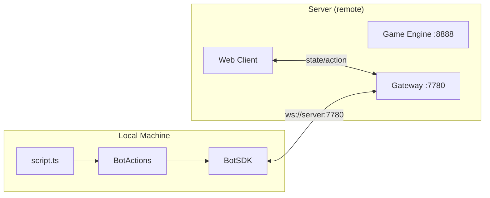
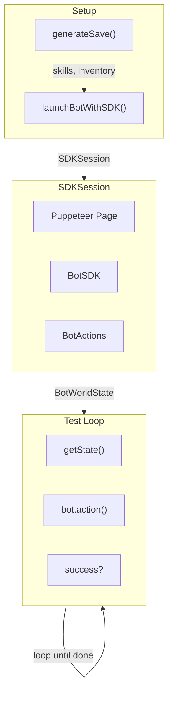

# System Architecture

## Overview

RS-Agent is a multi-layered bot automation framework. The architecture separates concerns into distinct layers: protocol (plumbing), domain logic (porcelain), and autonomous control (agent).



---

## Plumbing vs Porcelain

The SDK follows Git's two-layer model:

| Layer | File | Resolves When | Use Case |
|-------|------|---------------|----------|
| **Plumbing** | `sdk.ts` | Game acknowledges action | Fast, low-level protocol |
| **Porcelain** | `bot-actions.ts` | Effect is verified | Reliable, domain-aware |

### Plumbing Layer

Direct protocol mapping. ~40 `send*` methods. Never changes.

```typescript
sdk.sendWalk(x, z, running)
sdk.sendInteractLoc(x, z, locId, option)
sdk.sendInteractNpc(npcIndex, option)
sdk.sendShopBuy(slot, amount)
```

### Porcelain Layer

Domain knowledge baked in. Handles dialogs, multi-page UI, success signals.

```typescript
bot.chopTree(target?)      // Waits for logs OR tree disappears
bot.burnLogs(target?)      // Waits for firemaking XP
bot.buyFromShop(target, n) // Waits for item in inventory
bot.openDoor(target)       // Waits for door animation
```

---

## Message Flow



---

## State Model

All game state flows through `BotWorldState`:



**Key insight:** `GameMessage.tick` filters stale messages. Always compare against start tick.

---

## Agent System

The Claude Agent SDK service maintains persistent sessions with code execution capabilities.



### Agent Loop

1. Receive goal from controller
2. Inject initial state as context
3. Run query loop:
   - Analyze state delta
   - Generate SDK code
   - Execute via MCP
   - Update state
4. Repeat until goal achieved

---

## Remote Client Support

The SDK supports remote connections out of the box. Users can run scripts from anywhere that connect to a remote gateway.



### Remote Connection Example

```typescript
import { BotSDK } from '@rs-agent/sdk';
import { BotActions } from '@rs-agent/sdk/actions';

const sdk = new BotSDK({
    botUsername: 'player1',
    host: 'game-server.example.com',  // Remote server
    port: 7780
});

await sdk.connect();
const bot = new BotActions(sdk);

// Control the remote bot
await bot.chopTree();
await bot.burnLogs();
```

### Connection Configuration

| Option | Default | Description |
|--------|---------|-------------|
| `botUsername` | required | Bot to control |
| `host` | `'localhost'` | Gateway hostname |
| `port` | `7780` | Gateway port |
| `webPort` | `8888` | Game engine port (for pathfinding API) |
| `actionTimeout` | `30000` | Action timeout in ms |
| `autoReconnect` | `true` | Auto-reconnect on disconnect |
| `reconnectMaxRetries` | `Infinity` | Max reconnection attempts |
| `reconnectBaseDelay` | `1000` | Initial reconnect delay (ms) |
| `reconnectMaxDelay` | `30000` | Max reconnect delay (ms) |

### Connection States

```typescript
type ConnectionState = 'disconnected' | 'connecting' | 'connected' | 'reconnecting';

// Monitor connection
sdk.onConnectionStateChange((state, attempt) => {
    console.log(`Connection: ${state}${attempt ? ` (attempt ${attempt})` : ''}`);
});

// Wait for connection
await sdk.waitForConnection(60000);
```

---

## Component Map

| Component | Path | Purpose |
|-----------|------|---------|
| **Gateway** | `agent/gateway.ts` | Unified WebSocket router (sync + controller) |
| **SDK** | `agent/sdk.ts` | Low-level protocol mapping |
| **BotActions** | `agent/bot-actions.ts` | Domain-aware API |
| **Agent Service** | `agent/agent-service.ts` | Claude integration |
| **CLI** | `agent/cli.ts` | Command-line interface |
| **Types** | `agent/types.ts` | Shared type definitions |
| **Recorder** | `agent/run-recorder.ts` | Conversation logging |

---

## Test Infrastructure



### Test Categories

| Category | Examples | Count |
|----------|----------|-------|
| Skills | mining, fishing, cooking, smithing | 16 |
| Combat | attack, damage-detection | 2 |
| Navigation | walk, stairs, doors | 4 |
| Interaction | banking, shops, teleport | 6+ |
| Meta | loadtest, PRINCIPLES.md | 2 |

### Key Utilities

- `browser.ts` — Puppeteer session management, tutorial skip
- `save-generator.ts` — Pre-configured save files with positions, items, skills

---

## Network Ports

| Port | Service | Protocol |
|------|---------|----------|
| 7780 | Gateway | WebSocket (bot/SDK/UI) |
| 7782 | Agent SDK | WebSocket |
| 8888 | Engine | HTTP/WS |

---

## Success Signals

The porcelain layer uses specific signals to verify action completion:

| Action | Signal | Why |
|--------|--------|-----|
| Woodcutting | Logs in inventory OR tree gone | Either proves success |
| Firemaking | XP gain | Logs can vanish for other reasons |
| Pickup | Item in inventory | Definitive |
| Shop Buy | Item appears | Fails if no coins |
| Combat | Target HP decreases | Direct effect |
| Equipment | Item leaves inventory | State change |

---

## Patterns

### Tick-Based Filtering

```typescript
const startTick = sdk.getState()?.tick || 0
// Later...
messages.filter(m => m.tick > startTick)
```

### Multi-Page Dialog

```typescript
let lastClick = 0
await sdk.waitForCondition(state => {
  if (success(state)) return true
  if (state.dialog.isOpen && state.tick - lastClick >= 3) {
    sdk.sendClickDialog(0).catch(() => {})
    lastClick = state.tick
  }
  return false
})
```

### Dismiss Before Action

```typescript
await bot.dismissBlockingUI()
await bot.someAction()
```

---

## File Structure

```
agent/
├── agent-service.ts      # Claude agent service
├── gateway.ts            # Unified WebSocket router
├── bot-actions.ts        # Domain API (porcelain)
├── sdk.ts                # Protocol layer (plumbing)
├── cli.ts                # CLI tool
├── types.ts              # Shared types
├── run-recorder.ts       # Logging
└── agent-state/          # Per-bot state files
    └── <botname>/
        ├── player.json
        ├── skills.json
        ├── inventory.json
        └── world.md

sdk/                          # Standalone SDK package (@rs-agent/sdk)
├── package.json              # npm package config
├── index.ts                  # Main export (BotSDK)
├── actions.ts                # BotActions export
└── types.ts                  # Type definitions

scripts/                      # Example user scripts
├── example-remote.ts         # Remote connection example
└── ...

test/
├── utils/
│   ├── browser.ts        # Puppeteer helpers
│   └── save-generator.ts # Test save creation
└── *.ts                  # 40+ test files
```
